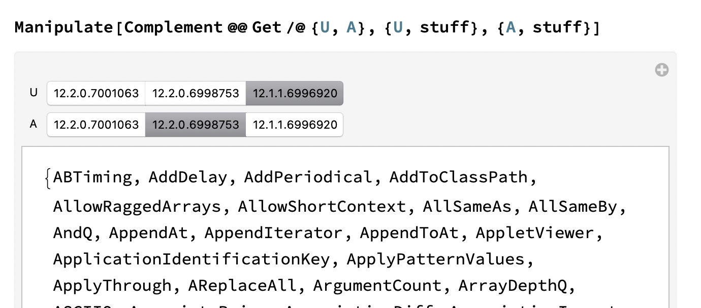

# NamesCheck

## What?

Compare the name space of different Mathematica builds.

Now with some sanity checking plus uses `GeneralUtilities` and `PrintDefinitions` for spelunking and exploration[^1].

 [^1]: Note that you can't spelunk stuff that doesn't exist in the current build. I thought about removing the hyperlinks for stuff like that, but figured, why should I keep you from trying?

## Look!

## Contact...

flip phillips, flip@flipphillips.com, https://flipphillips.com

## License §

MIT, (c) 2020.